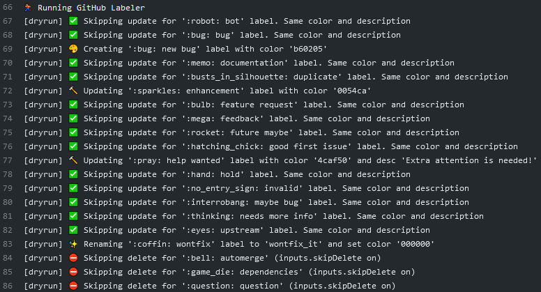

[](https://github.com/crazy-max/ghaction-github-labeler/releases/latest)
[](https://github.com/marketplace/actions/github-labeler)
[](https://github.com/crazy-max/ghaction-github-labeler/actions/?workflow=test)
[](https://www.patreon.com/crazymax) 
[](https://www.paypal.me/crazyws)

## ✨ About

GitHub Action to manage labels on GitHub (create/rename/update/delete) as code.

> **:warning: Note:** To use this action, you must have access to the [GitHub Actions](https://github.com/features/actions) feature. GitHub Actions are currently only available in public beta. You can [apply for the GitHub Actions beta here](https://github.com/features/actions/signup/).



## 🚀 Usage

### 📝 YAML configuration

In the repository where you want to perform this action, create the YAML file `.github/labels.yml` (you can also set a [custom filename](#-customizing)) that looks like:

```yaml
- name: bug
  color: d73a4a
  description: "Something isn't working"
- name: documentation
  color: 0075ca
  description: "Improvements or additions to documentation"
- name: duplicate
  color: cfd8d7
  description: "This issue or pull request already exists"
- name: enhancement
  color: a22eef
- name: wontfix_it
  color: "000000"
  description: "This will not be worked on"
  from_name: wontfix
```

* `name`, `color` and `description` are the main [GitHub label fields](https://developer.github.com/v3/issues/labels/#parameters)
* `description` can be omit if your want to keep the current one
* `from_name` allow to rename a label from one currently available on your repository

### 🐙 Workflow

```yaml
name: github

on: push

jobs:
  labeler:
    runs-on: ubuntu-latest
    steps:
      -
        name: Checkout
        uses: actions/checkout@v1
      -
        name: Run Labeler
        if: success()
        uses: crazy-max/ghaction-github-labeler@v1
        with:
          yaml_file: .github/labels.yml
          skip_delete: false
          dry_run: false
        env:
          GITHUB_TOKEN: ${{ secrets.GITHUB_TOKEN }}
```

With this workflow, the YAML configuration above on a [fresh repository](.res/samples/original.yml), this will:

* Skip `bug` (because same `color` and `description`)
* Skip `documentation` (because same `color` and `description`)
* Update `duplicate` (`color` is different)
* Update `enhancement` (`color` is different, keep current `description`)
* Delete `good first issue`
* Delete `help wanted`
* Delete `invalid`
* Delete `question`
* Rename `wontfix` to `wontfix_it` and set `color` and `description`

## 💅 Customizing

### inputs

Following inputs can be used as `step.with` keys

| Name            | Type    | Description                                                                        |
|-----------------|---------|------------------------------------------------------------------------------------|
| `yaml_file`     | String  | Path to YAML file containing labels definitions (default `.github/labels.yml`)     |
| `skip_delete`   | Bool    | If enabled, labels will not be deleted if not found in YAML file (default `false`) |
| `dry_run`       | Bool    | If enabled, changes will not be applied (default `false`)                          |

### environment variables

Following environment variables can be used as `step.env` keys

| Name           | Description                          |
|----------------|--------------------------------------|
| `GITHUB_TOKEN` | GITHUB_TOKEN as provided by `secrets`|

## 🤝 How can I help ?

All kinds of contributions are welcome :raised_hands:!<br />
The most basic way to show your support is to star :star2: the project, or to raise issues :speech_balloon:<br />
But we're not gonna lie to each other, I'd rather you buy me a beer or two :beers:!

[](https://www.patreon.com/crazymax) 
[](https://www.paypal.me/crazyws)

## 📝 License

MIT. See `LICENSE` for more details.
