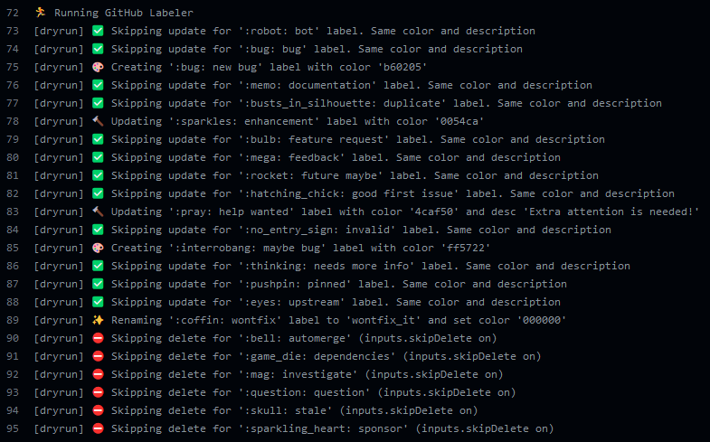

[](https://github.com/crazy-max/ghaction-github-labeler/releases/latest)
[](https://github.com/marketplace/actions/github-labeler)
[](https://github.com/crazy-max/ghaction-github-labeler/actions?workflow=test)
[](https://codecov.io/gh/crazy-max/ghaction-github-labeler)
[](https://github.com/sponsors/crazy-max)
[](https://www.paypal.me/crazyws)

## About

GitHub Action to manage labels on GitHub (create/rename/update/delete) as code.

If you are interested, [check out](https://github.com/crazy-max?tab=repositories&q=ghaction&type=source&language=&sort=) my other :octocat: GitHub Actions!



___

* [Usage](#usage)
  * [YAML configuration](#yaml-configuration)
  * [Workflow](#workflow)
* [Customizing](#customizing)
  * [inputs](#inputs)
* [Contributing](#contributing)
* [License](#license)

## Usage

### YAML configuration

In the repository where you want to perform this action, create the YAML file `.github/labels.yml` (you can also set a [custom filename](#customizing)) that looks like:

```yaml
- name: "bug"
  color: "d73a4a"
  description: "Something isn't working"
- name: "documentation"
  color: "0075ca"
  description: "Improvements or additions to documentation"
- name: "duplicate"
  color: "cfd8d7"
  description: "This issue or pull request already exists"
- name: "enhancement"
  color: "a22eef"
- name: "wontfix_it"
  color: "000000"
  description: "This will not be worked on"
  from_name: "wontfix"
```

* `name`, `color` and `description` are the main [GitHub label fields](https://developer.github.com/v3/issues/labels/#parameters)
* `description` can be omit if your want to keep the current one
* `from_name` allow to rename a label from one currently available on your repository

### Workflow

```yaml
name: github

on: push

jobs:
  labeler:
    runs-on: ubuntu-latest
    steps:
      -
        name: Checkout
        uses: actions/checkout@v3
      -
        name: Run Labeler
        if: success()
        uses: crazy-max/ghaction-github-labeler@v4
        with:
          github-token: ${{ secrets.GITHUB_TOKEN }}
          yaml-file: .github/labels.yml
          skip-delete: false
          dry-run: false
          exclude: |
            help*
            *issue
```

With this workflow, the YAML configuration above on a [fresh repository](samples/original.yml), this will:

* Skip `bug` (because same `color` and `description`)
* Skip `documentation` (because same `color` and `description`)
* Update `duplicate` (`color` is different)
* Update `enhancement` (`color` is different, keep current `description`)
* Leave `good first issue` alone (because it matches an `exclude` pattern)
* Leave `help wanted` alone (because it matches an `exclude` pattern)
* Delete `invalid`
* Delete `question`
* Rename `wontfix` to `wontfix_it` and set `color` and `description`

## Customizing

### inputs

Following inputs can be used as `step.with` keys

| Name           | Type   | Description                                                                                                                                                                          |
|----------------|--------|--------------------------------------------------------------------------------------------------------------------------------------------------------------------------------------|
| `github-token` | String | [GitHub Token](https://help.github.com/en/actions/configuring-and-managing-workflows/authenticating-with-the-github_token) as provided by `secrets`. (default `${{ github.token }}`) |
| `yaml-file`    | String | Path to YAML file containing labels definitions. (default `.github/labels.yml`)                                                                                                      |
| `skip-delete`  | Bool   | If enabled, labels will not be deleted if not found in YAML file. (default `false`)                                                                                                  |
| `dry-run`      | Bool   | If enabled, changes will not be applied. (default `false`)                                                                                                                           |
| `exclude`      | List   | Newline delimited list of labels pattern(s)/matcher to exclude                                                                                                                       |

## Contributing

Want to contribute? Awesome! The most basic way to show your support is to star the project, or to raise issues. If
you want to open a pull request, please read the [contributing guidelines](.github/CONTRIBUTING.md).

You can also support this project by [**becoming a sponsor on GitHub**](https://github.com/sponsors/crazy-max) or by
making a [Paypal donation](https://www.paypal.me/crazyws) to ensure this journey continues indefinitely!

Thanks again for your support, it is much appreciated! :pray:

## License

MIT. See `LICENSE` for more details.
